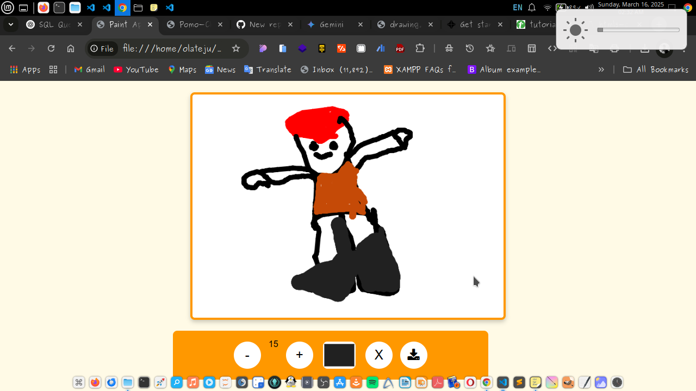

# Paint Application 🎨

## Overview
This is a **simple yet powerful** paint application built using **HTML, CSS, and JavaScript** with the Canvas API. It allows users to draw, change brush sizes, pick colors, clear the canvas, and even **download their artwork** as an image.

🚀 **Tech Stack**:
- HTML5 Canvas API 🎨
- JavaScript (ES6+)
- CSS3 (Responsive & Stylish)

## Features 🔥
✅ Draw freely on a canvas using the mouse 🖱️  
✅ Adjust brush size (+ / - buttons) 🎨  
✅ Change brush color with a color picker 🎨  
✅ Clear the entire canvas with one click 🧼  
✅ **Download your drawing** as a PNG file 🖼️  
✅ **Dark Mode Toggle** for better UX 🌙 🔆  
✅ **Stylish UI with icons** for a smooth experience 🎨  

## Installation & Usage 🚀
1. Clone the repository:  
   ```sh
   git clonehttps://github.com/tejHacks/web-paint.git
   ```
2. Open the `index.html` file in your browser.
3. Start drawing! 🖌️

## How It Works 🛠️
- Uses the **Canvas API** to capture mouse movements and draw on the canvas.
- Listens for `mousedown`, `mousemove`, and `mouseup` events to track drawing.
- Allows users to increase/decrease the brush size dynamically.
- Lets users **change colors** using an input color picker.
- Implements a **clear button** that wipes the canvas.
- Provides a **download button** to save drawings as images.
- Includes **dark mode** for a better user experience at night.

## Future Enhancements ✨
🚀 **Undo & Redo** functionality  
🚀 Add **different brush styles** (spray, dotted, textured)  
🚀 Implement **shapes (rectangles, circles, lines, etc.)**  
🚀 Allow **drag-and-drop image upload** for editing  

## Screenshots 📸


## Contributing 🤝
1. Fork the repo & clone it locally.
2. Create a new branch: `git checkout -b feature-name`
3. Commit your changes: `git commit -m 'Added new feature'`
4. Push to your branch: `git push origin feature-name`
5. Submit a Pull Request! 🚀

## License 📜
This project is **open-source** and available under the MIT License.

---

Made with ❤️ by **tejHacks** 🚀

